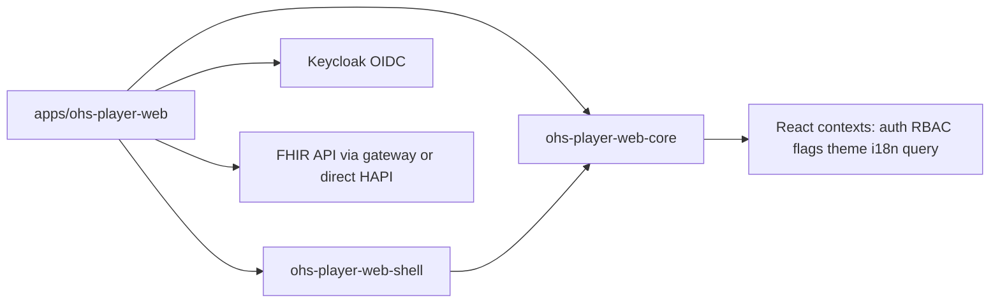

# Architecture overview

Full **`ohs-player-web-core` API**: see [CORE_PUBLIC_API.md](./CORE_PUBLIC_API.md).

This repository implements the “core library + reference app” split described in the OHS architecture PDFs in the repo root, with the portal shell between them as its own package so another application can import it rather than copy it.

Dependencies point one way. The library never imports the shell or an app, and the shell never imports an app.

| Layer | Package | Owns |
| --- | --- | --- |
| Library | `packages/ohs-player-web-core` | Behaviour only: providers, auth, the FHIR client and hooks, RBAC, flags, i18n, the theme engine, audit, SDC, Radix wrappers, and the `ExtensionManifest` types. No routes and no presentational UI. |
| Shell | `packages/ohs-player-web-shell` | The portal frame: the route table, layout, `ProtectedRoute`, the sign-in, logout, callback and unauthorized pages, the dashboard, global search, the activity feed, light and dark mode, the primitive kit and its CSS, the portal config resolver and context, the navigation defaults, and the extension host. |
| App | `apps/ohs-player-web`, `apps/ohs-player-web-example` | Its feature folders, `public/portal-config.json` and its schema, `config/env.ts`, `loadPortalConfig.ts`, its message catalogue, its theme pins (`sysTheme.ts`), its bundled questionnaires, and the list of extensions it installs. |

## `ohs-player-web-core`

- **`CorePlatformProvider`** — Single composition root: TanStack Query, FHIR base URL, OIDC `AuthConfig`, optional `RbacConfig`, `FlagsConfig`, `I18nConfig`, `customEndpoints`, `onError`.
- **Auth** — `oidc-client-ts` `UserManager`, Authorization Code + PKCE, silent renew; `useAuth()` exposes login/logout/`handleRedirectCallback` for `/callback`.
- **RBAC** — Roles from JWT (`claimPath`, default `roles`) mapped through host-supplied `permissionMap`; `usePermission`, `PermissionGuard`, `RoleGuard`.
- **Feature flags** — Booleans (`FlagsConfig.flags`) resolved at startup from the host's configuration, `useFlag`, `FeatureGuard`; evaluate **flag → auth → permission** when composing routes.
- **FHIR** — `FhirClient` (fetch + 401 retry): CRUD, `transaction`, `capabilities`, **`postOperation`** for FHIR `$` operations (e.g. `Questionnaire/$extract`), plus `customGet` / `customPost` for gateway aliases. TanStack Query hooks: `useResource`, `useSearch`, `useCreateResource`, `useUpdateResource`, `useCustomEndpoint`, `useFhirCapabilities`.
- **Structured Data Capture (SDC)** — Reusable Questionnaire capture: `QuestionnaireFields`, `QuestionnaireForm`, `useQuestionnaireFormState`, `buildQuestionnaireResponse`, `validateRequiredAnswers`, `formatQuestionnaireCanonical`, plus FHIR-lite types for `Questionnaire` / `QuestionnaireResponse`. Questionnaire **definitions** are expected to be supplied by the host app (bundled JSON); the core renders items and builds responses. See [CORE_PUBLIC_API.md](./CORE_PUBLIC_API.md).
- **Theming** — Design tokens emitted as one stylesheet of CSS custom properties (`--ohs-sys-*`, `--ohs-ref-*`) by `installThemeCss()`; see **UI primitives & theming** below and [THEMING.md](./THEMING.md).
- **i18n** — Typed default English catalog; `useTranslation` with `{{interpolation}}`.
- **Audit** — `writeAuditEvent()` creates `AuditEvent` resources for mutating flows. See [AuditEvent shape](#auditevent-shape) for the recorded fields and decisions.

### AuditEvent shape

`writeAuditEvent(client, params)` (`src/audit/writeAudit.ts`) posts one FHIR R4 `AuditEvent` per mutation via `client.create`. The recorded shape and the decisions behind it:

| `AuditEvent` field | Value | Decision |
| ------------------ | ----- | -------- |
| `type` | `rest` / "RESTful Operation" (`audit-event-type`) | All portal writes are REST operations. |
| `action` | `C` / `U` / `D` | Mapped from `params.action` (`create`/`update`/`delete`). The R4 value set also has `R` (read) and `E` (execute); the portal only audits **mutations**, so reads/executes are intentionally not emitted. |
| `recorded` | ISO timestamp | Set at write time. |
| `agent[0].who.display` | `params.agentDisplay` (else `"Portal user"`) | **Open item:** this is a *display string*, not a `Practitioner/{id}` reference. A real actor reference needs a `fhirUser` token claim (or a Practitioner lookup) — tracked separately; until then the agent is best-effort display. |
| `agent[0].type` | `author` (`provenance-participant-type`), `requestor: true` | The signed-in portal user is the requesting author. |
| `source.observer.display` | `"OHS Player Web"` | Fixed source label for the reference app. |
| `entity[0].what.reference` | `{resourceType}/{resourceId}` | Present only when `resourceId` is given; omitted (`entity: []`) otherwise. |
| `entity[0].description` | `params.description` | Optional free-text (e.g. "Linked to Organization/o1"); omitted when absent. |

Decisions of note: `outcome` is **not** recorded (the call rejects on failure, so a written `AuditEvent` always represents a success — there are no failed-write audit entries by design). The function does **not** swallow errors — a failed `client.create` rejects to the caller. Per-mutation wiring (which flows call it, with what `description`) is the consumer's responsibility.

## `ohs-player-web-shell`

- **Route table** — the sign-in, logout, callback and unauthorized pages, the dashboard at `/`, the host app's own routes, and extension routes, all under one portal frame. Every page is a `React.lazy` import, and the frame's outlet sits in `Suspense` with the `Spinner` primitive as its fallback. Each route is gated through `ProtectedRoute` from its `requires: { flag, permission }`, in a fixed order: a switched-off flag renders nothing, then a signed-out visitor goes to sign-in, then the permission is checked.
- **Primitive kit** — the presentational components in `src/components/ui/`, their icons and `cn`, exported from the package entry. The styles ship as source CSS: `ohs-player-web-shell/theme.css`, `ohs-player-web-shell/index.css` (the frame), and `ohs-player-web-shell/tailwind.css` (the utility-to-token bridge, which the host app compiles with its own Tailwind build).
- **Configuration** — `resolvePortalConfig(defaults, document)` merges a configuration document over the host app's build-time values. `PortalConfigContext` and `usePortalConfig` expose the result, and `DEFAULT_NAVIGATION` is the sidebar a document can replace.

### Extension host

`createPortalHost({ defaults, document, extensions, routes, development })` runs once in `main.tsx`, before render. `PortalHost` takes its result, provides it through context and renders the portal.

- **Merge order** is the app's defaults, then the extensions, then the configuration document. An extension cannot displace an app's message, flag, permission or endpoint alias, and a deployment can still override an extension's flag default, roles or copy.
- **Namespacing.** Route, nav, widget and slot contribution ids become `<manifestId>.<id>`. Message keys, flags, permission keys and endpoint aliases stay flat.
- **Startup validation.** Each manifest first passes the library's `validateExtensionManifest`, with the shell's regions and slot names. It then fails when its id is taken, when it declares a key, id or route path another manifest or the host already declares, or when a `requires.permission` on one of its routes, nav entries or widgets is missing from the merged permission map. In development the error is thrown and the app does not render. In production it goes to the platform `onError` callback and that manifest is dropped, while the shell and every valid extension still render.
- **Navigation.** Extension nav entries join the sidebar, sorted by `order` among the shell's entries, which are spaced ten apart.
- **Dashboard regions.** `DashboardRegion` is `'kpi' | 'main' | 'side'`. The built-in cards sit at orders 10 to 40, and a `main` and a `side` widget with the same order share a row.
- **Slots.** `Slot` renders the contributions registered for a slot name, in order, each given that slot's typed context. The first slot is `users.rowActions`, in the users table's row menu, with `{ practitioner }` as its context.
- **Isolation.** Each widget and each slot contribution sits behind an error boundary. One that throws renders the `ErrorState` primitive in its own place and reports through `onError`, and the rest of the screen carries on.
- **Questionnaires** an extension registers are kept under its manifest id and read with `useExtensionQuestionnaire(manifestId, key)`.

## Example application

[`apps/ohs-player-web-example`](../apps/ohs-player-web-example) is a second application built on the shell, and proves the extension model. It has its own configuration document (a teal brand pin, with Users listed before Dashboard), a trimmed copy of the reference app's env, loader and message catalogue, and one screen of its own: a users table whose row menu hosts the `users.rowActions` slot. Its `schedules` extension lives in `src/extensions/schedules` and uses every registration point. Outside that folder, its only change is its line in `src/extensions.ts`. See [EXTENDING.md](./EXTENDING.md).

## Reference application

[`apps/ohs-player-web`](../apps/ohs-player-web) loads a runtime configuration document (`public/portal-config.json`, validated at build and at boot, with `VITE_*` values as the fallback; see [DEPLOYMENT.md](./DEPLOYMENT.md)). It hands that document, its `portalDefaults`, its feature routes (`AppRoutes.tsx`) and its extension list (`extensions.ts`) to `createPortalHost`, then renders `PortalHost`. Its feature modules cover users, locations, organizations, care teams, the setup wizard and the FHIR viewer.

### Bundled questionnaires (SDC)

Location and organization editing uses FHIR `Questionnaire` JSON **bundled in the app** ([`apps/ohs-player-web/src/questionnaires/`](../apps/ohs-player-web/src/questionnaires/)), selected via `env.questionnaireVariant` / [`registry.ts`](../apps/ohs-player-web/src/questionnaires/registry.ts). On save, the UI posts a `QuestionnaireResponse` then creates or updates the target `Location` / `Organization` using small app-side mappers ([`resourceFromAnswers.ts`](../apps/ohs-player-web/src/features/sdc/resourceFromAnswers.ts)). Server-side `$extract` remains optional via `FhirClient.postOperation` when the FHIR stack supports it.

## Local infrastructure

`docker-compose.yml` runs HAPI FHIR, Keycloak with an imported `ohs` realm, and a small nginx service on port **8180** that proxies `/fhir` to HAPI and returns **501** for `/custom/*` until a real OHS gateway image is configured.

## UI primitives & theming

> Material Web (`@material/web`) and its `--md-sys-*` token bridge were **removed** (commit `dad988f`). The library no longer ships presentational primitives; styling is plain CSS driven by `--ohs-*` design tokens.

### Layer split

- **Library (`ohs-player-web-core`)** ships only **behavior + Radix wrappers** and the theme engine — `OhsDialog`, `OhsDropdownMenu`, `OhsTabs`, `OhsToast`, `OhsTooltip`, `StatusBar`, the SDC `QuestionnaireForm`/`QuestionnaireFields`, and `themeCss`/`installThemeCss`. It does **not** export `Button`, `Card`, `TextField`, etc.
- **Shell (`packages/ohs-player-web-shell/src/components/ui/`)** owns the **presentational primitives**: `Button`, `Card`, `Field`/`TextField`/`SelectField`/`TextAreaField`, `Combobox`, `Listbox`, `SearchField`, `DataTable`, `Drawer`, `Layout` (`Page`/`PageHeader`/`Stack`/`Inline`), `States` (`EmptyState`/`ErrorState`/`Spinner`/`LinearProgress`/`StatusBadge`), `Switch`, `Checkbox`, `Chips`, `Avatar`, `KpiBadge`, `DonutChart`, and the icon set.

The library must never import from the shell or an app, and the shell must never import from an app. Feature code imports primitives from `'ohs-player-web-shell'`.

### Implementation per area

| Area | Implementation |
| ---- | -------------- |
| Buttons, icon button, fields, select, textarea, spinner | **Shell** primitives — plain React + token-driven CSS (`components/ui/`) |
| Card, page layout, tables, empty/error/loading states, status badge, donut chart | **Shell** primitives — token-driven CSS |
| Dialog, dropdown menu, tabs, toast, tooltip | **Library** Radix wrappers (`OhsDialog`, `OhsDropdownMenu`, `OhsTabs`, `OhsToast`, `OhsTooltip`) |
| Status bar, SDC questionnaire form/fields | **Library** behavior components |

### Theming

`installThemeCss(themeConfigV2)` runs once in `main.tsx`, before render, and writes every `--ohs-sys-*` and `--ohs-ref-*` token as a single stylesheet on `:root`, so Radix portals rendered outside `[data-ohs-root]` inherit them. It carries both colour schemes; `ThemeModeProvider` switches between them by setting `data-theme` on `<html>`. Nothing else writes tokens, and the shell's `src/components/ui/theme.css` only consumes them. Downstream consumers reskin by supplying a different `ThemeConfigV2` (see `sysTheme` in the reference app) — **no component forking required**. See [THEMING.md](./THEMING.md).
