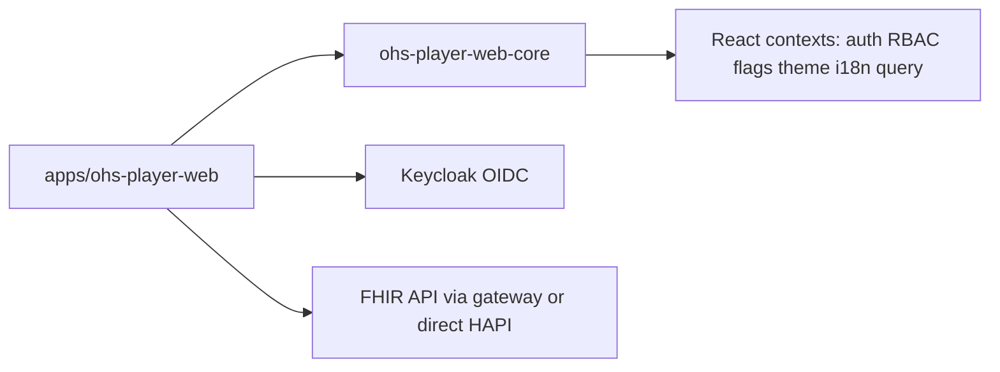

# Architecture overview

Full **`ohs-player-web-core` API**: see [CORE_PUBLIC_API.md](./CORE_PUBLIC_API.md).

This repository implements the “core library + reference app” split described in the OHS architecture PDFs in the repo root.

## `ohs-player-web-core`

- **`CorePlatformProvider`** — Single composition root: TanStack Query, FHIR base URL, OIDC `AuthConfig`, optional `RbacConfig`, `FlagsConfig`, `I18nConfig`, `ThemeConfig`, `customEndpoints`, `onError`.
- **Auth** — `oidc-client-ts` `UserManager`, Authorization Code + PKCE, silent renew; `useAuth()` exposes login/logout/`handleRedirectCallback` for `/callback`.
- **RBAC** — Roles from JWT (`claimPath`, default `roles`) mapped through host-supplied `permissionMap`; `usePermission`, `PermissionGuard`, `RoleGuard`.
- **Feature flags** — Build-time booleans (`FlagsConfig.flags`), `useFlag`, `FeatureGuard`; evaluate **flag → auth → permission** when composing routes.
- **FHIR** — `FhirClient` (fetch + 401 retry): CRUD, `transaction`, `capabilities`, **`postOperation`** for FHIR `$` operations (e.g. `Questionnaire/$extract`), plus `customGet` / `customPost` for gateway aliases. TanStack Query hooks: `useResource`, `useSearch`, `useCreateResource`, `useUpdateResource`, `useCustomEndpoint`, `useFhirCapabilities`.
- **Structured Data Capture (SDC)** — Reusable Questionnaire capture: `QuestionnaireFields`, `QuestionnaireForm`, `useQuestionnaireFormState`, `buildQuestionnaireResponse`, `validateRequiredAnswers`, `formatQuestionnaireCanonical`, plus FHIR-lite types for `Questionnaire` / `QuestionnaireResponse`. Questionnaire **definitions** are expected to be supplied by the host app (bundled JSON); the core renders items and builds responses. See [CORE_PUBLIC_API.md](./CORE_PUBLIC_API.md).
- **Theming** — Design tokens applied as CSS custom properties (`--ohs-*`) via `applyTheme()`; see **UI primitives & theming** below.
- **i18n** — Typed default English catalog; `useTranslation` with `{{interpolation}}`.
- **Audit** — `writeAuditEvent()` creates `AuditEvent` resources for mutating flows. See [AuditEvent shape](#auditevent-shape) for the recorded fields and decisions.

### AuditEvent shape

`writeAuditEvent(client, params)` (`src/audit/writeAudit.ts`) posts one FHIR R4 `AuditEvent` per mutation via `client.create`. The recorded shape and the decisions behind it:

| `AuditEvent` field | Value | Decision |
| ------------------ | ----- | -------- |
| `type` | `rest` / "RESTful Operation" (`audit-event-type`) | All portal writes are REST operations. |
| `action` | `C` / `U` / `D` | Mapped from `params.action` (`create`/`update`/`delete`). The R4 value set also has `R` (read) and `E` (execute); the portal only audits **mutations**, so reads/executes are intentionally not emitted. |
| `recorded` | ISO timestamp | Set at write time. |
| `agent[0].who.display` | `params.agentDisplay` (else `"Portal user"`) | **Open item:** this is a *display string*, not a `Practitioner/{id}` reference. A real actor reference needs a `fhirUser` token claim (or a Practitioner lookup) — tracked separately; until then the agent is best-effort display. |
| `agent[0].type` | `author` (`provenance-participant-type`), `requestor: true` | The signed-in portal user is the requesting author. |
| `source.observer.display` | `"OHS Player Web"` | Fixed source label for the reference app. |
| `entity[0].what.reference` | `{resourceType}/{resourceId}` | Present only when `resourceId` is given; omitted (`entity: []`) otherwise. |
| `entity[0].description` | `params.description` | Optional free-text (e.g. "Linked to Organization/o1"); omitted when absent. |

Decisions of note: `outcome` is **not** recorded (the call rejects on failure, so a written `AuditEvent` always represents a success — there are no failed-write audit entries by design). The function does **not** swallow errors — a failed `client.create` rejects to the caller. Per-mutation wiring (which flows call it, with what `description`) is the consumer's responsibility.

## Reference application

[`apps/ohs-player-web`](apps/ohs-player-web) wires environment-driven `platformConfig`, React Router routes, and feature modules for users, locations, organizations, care teams, and a simple dashboard.

### Bundled questionnaires (SDC)

Location and organization editing uses FHIR `Questionnaire` JSON **bundled in the app** ([`apps/ohs-player-web/src/questionnaires/`](../apps/ohs-player-web/src/questionnaires/)), selected via `env.questionnaireVariant` / [`registry.ts`](../apps/ohs-player-web/src/questionnaires/registry.ts). On save, the UI posts a `QuestionnaireResponse` then creates or updates the target `Location` / `Organization` using small app-side mappers ([`resourceFromAnswers.ts`](../apps/ohs-player-web/src/features/sdc/resourceFromAnswers.ts)). Server-side `$extract` remains optional via `FhirClient.postOperation` when the FHIR stack supports it.

## Local infrastructure

`docker-compose.yml` runs HAPI FHIR, Keycloak with an imported `ohs` realm, and a small nginx service on port **8180** that proxies `/fhir` to HAPI and returns **501** for `/custom/*` until a real OHS gateway image is configured.

## UI primitives & theming

> Material Web (`@material/web`) and its `--md-sys-*` token bridge were **removed** (commit `dad988f`). The library no longer ships presentational primitives; styling is plain CSS driven by `--ohs-*` design tokens.

### Layer split

- **Library (`ohs-player-web-core`)** ships only **behavior + Radix wrappers** and the theme engine — `OhsDialog`, `OhsDropdownMenu`, `OhsTabs`, `OhsToast`, `OhsTooltip`, `StatusBar`, the SDC `QuestionnaireForm`/`QuestionnaireFields`, and `applyTheme`/`mergeTheme`/`defaultTheme`. It does **not** export `Button`, `Card`, `TextField`, etc.
- **App (`apps/ohs-player-web/src/components/ui/`)** owns the **presentational primitives**: `Button`, `Card`, `Field`/`TextField`/`SelectField`/`TextAreaField`, `DataTable`, `Drawer`, `Layout` (`Page`/`PageHeader`/`Stack`/`Inline`), `States` (`EmptyState`/`ErrorState`/`Spinner`/`LinearProgress`/`StatusBadge`), `Switch`, `Checkbox`, `Chips`, `DonutChart`.

The library must never import from the app; feature code imports primitives from `'../../components/ui'`.

### Implementation per area

| Area | Implementation |
| ---- | -------------- |
| Buttons, icon button, fields, select, textarea, spinner | **App** primitives — plain React + token-driven CSS (`components/ui/`) |
| Card, page layout, tables, empty/error/loading states, status badge, donut chart | **App** primitives — token-driven CSS |
| Dialog, dropdown menu, tabs, toast, tooltip | **Library** Radix wrappers (`OhsDialog`, `OhsDropdownMenu`, `OhsTabs`, `OhsToast`, `OhsTooltip`) |
| Status bar, SDC questionnaire form/fields | **Library** behavior components |

### Theming

`applyTheme(themeConfig, element)` sets the managed `--ohs-*` colour/typography/radius tokens as CSS custom properties on the element (the app applies it to `[data-ohs-root]` and to `<html>` so Radix portals inherit it). The remaining static tokens (neutral scale, secondary/tertiary borders, the granular type scale, dark-mode overrides) live in `apps/ohs-player-web/src/components/ui/theme.css`. Downstream consumers reskin by supplying a different `ThemeConfig` (see `lightTheme`/`darkTheme`/`altTheme` in the reference app; `VITE_THEME_ALT=true` swaps in the alternate theme) — **no component forking required**.
