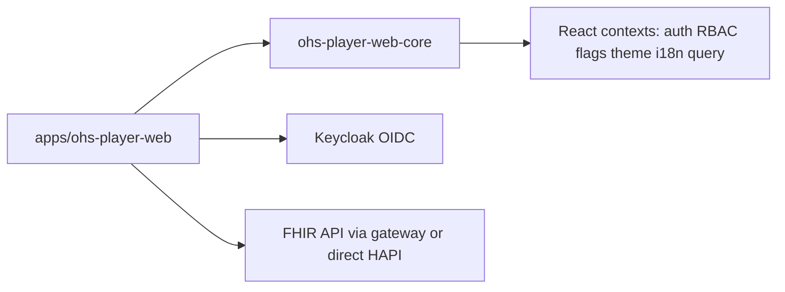

# Architecture overview

Full **`ohs-player-web-core` API**: see [CORE_PUBLIC_API.md](./CORE_PUBLIC_API.md).

This repository implements the “core library + reference app” split described in the OHS architecture PDFs in the repo root.

## `ohs-player-web-core`

- **`CorePlatformProvider`** — Single composition root: TanStack Query, FHIR base URL, OIDC `AuthConfig`, optional `RbacConfig`, `FlagsConfig`, `I18nConfig`, `ThemeConfig`, `customEndpoints`, `onError`.
- **Auth** — `oidc-client-ts` `UserManager`, Authorization Code + PKCE, silent renew; `useAuth()` exposes login/logout/`handleRedirectCallback` for `/callback`.
- **RBAC** — Roles from JWT (`claimPath`, default `roles`) mapped through host-supplied `permissionMap`; `usePermission`, `PermissionGuard`, `RoleGuard`.
- **Feature flags** — Build-time booleans (`FlagsConfig.flags`), `useFlag`, `FeatureGuard`; evaluate **flag → auth → permission** when composing routes.
- **FHIR** — `FhirClient` (fetch + 401 retry): CRUD, `transaction`, `capabilities`, **`postOperation`** for FHIR `$` operations (e.g. `Questionnaire/$extract`), plus `customGet` / `customPost` for gateway aliases. TanStack Query hooks: `useResource`, `useSearch`, `useCreateResource`, `useUpdateResource`, `useCustomEndpoint`, `useFhirCapabilities`.
- **Structured Data Capture (SDC)** — Reusable Questionnaire capture: `QuestionnaireFields`, `QuestionnaireForm`, `useQuestionnaireFormState`, `buildQuestionnaireResponse`, `validateRequiredAnswers`, `formatQuestionnaireCanonical`, plus FHIR-lite types for `Questionnaire` / `QuestionnaireResponse`. Questionnaire **definitions** are expected to be supplied by the host app (bundled JSON); the core renders items and builds responses. See [CORE_PUBLIC_API.md](./CORE_PUBLIC_API.md).
- **Theming** — Design tokens applied as CSS custom properties (`--ohs-*`); see **Material 3 integration** below for how those map to Material Web.
- **i18n** — Typed default English catalog; `useTranslation` with `{{interpolation}}`.
- **Audit** — `writeAuditEvent()` creates `AuditEvent` resources for mutating flows (no reporting UI in MVP).

## Reference application

[`apps/ohs-player-web`](apps/ohs-player-web) wires environment-driven `platformConfig`, React Router routes, and feature modules for users, locations, organizations, care teams, and a simple dashboard.

### Bundled questionnaires (SDC)

Location and organization editing uses FHIR `Questionnaire` JSON **bundled in the app** ([`apps/ohs-player-web/src/questionnaires/`](../apps/ohs-player-web/src/questionnaires/)), selected via `env.questionnaireVariant` / [`registry.ts`](../apps/ohs-player-web/src/questionnaires/registry.ts). On save, the UI posts a `QuestionnaireResponse` then creates or updates the target `Location` / `Organization` using small app-side mappers ([`resourceFromAnswers.ts`](../apps/ohs-player-web/src/features/sdc/resourceFromAnswers.ts)). Server-side `$extract` remains optional via `FhirClient.postOperation` when the FHIR stack supports it.

## Local infrastructure

`docker-compose.yml` runs HAPI FHIR, Keycloak with an imported `ohs` realm, and a small nginx service on port **8180** that proxies `/fhir` to HAPI and returns **501** for `/custom/*` until a real OHS gateway image is configured.

## Material 3 integration (`@material/web`)

The primitive kit in `ohs-player-web-core` uses **Google Material Web** (`@material/web` **2.x**) for real M3 controls while keeping the **same React component exports** (`Button`, `TextField`, `SelectField`, `Spinner`, `OhsTabs`, `OhsDropdownMenu`, etc.). This avoids hand-rolled M3 lookalikes for those pieces and stays aligned with upstream accessibility and interaction patterns.

### Why `@material/web`

- Ships Web Components (Lit) for buttons, fields, select, menus, tabs, progress, etc.
- Version **2.4.x** in this repo registers components such as `md-filled-tonal-button` (not the older `tonal-button.js` entry). Imports are **per-component** (`packages/ohs-player-web-core/src/ui/m3/imports.ts`); we do **not** load `@material/web/all.js`.

### Token bridge (`--md-sys-*` → `--ohs-*`)

`packages/ohs-player-web-core/src/ui/m3/m3-bridge.css` is loaded from the library entry next to `theme.css`. On `[data-ohs-root]` it maps Material system tokens to existing OHS tokens so **`applyTheme()`** rebrands both custom CSS and Material Web in one shot. Examples:

| Material token | OHS token |
| --- | --- |
| `--md-sys-color-primary` | `--ohs-color-primary` |
| `--md-sys-color-on-surface` | `--ohs-color-text` |
| `--md-sys-color-outline` | `--ohs-color-border` |
| `--md-sys-color-error` | `--ohs-color-error` |
| `--md-sys-typescale-body-medium-font` | `--ohs-font-body` |
| `--md-sys-shape-corner-medium` | `--ohs-radius-default` |

(The stylesheet contains the full set used by our wrappers.)

### M3-backed vs custom / Radix

| Area | Implementation |
| --- | --- |
| Buttons, icon button, fields, select, spinner | `@material/web` (`Button`, `IconButton`, `TextField`, `TextAreaField`, `SelectField`, `Spinner`) |
| Dropdown menu, tabs | `@material/web` (`md-menu`, `md-tabs`) behind `OhsDropdownMenu`, `OhsTabs` compound APIs |
| Dialog | **Radix** `OhsDialog` (Material `md-dialog` possible follow-up) |
| Toast, tooltip | **Radix** — no equivalent in `@material/web` |
| Card, page layout, tables, empty/error states, status | **Custom** token-driven CSS (`theme.css`) |

### Host apps and bundle layout

The core package **externalizes** `@material/web/*` in its Vite library build so **`dist/index.js`** stays small; **consumers must depend on `@material/web`** so their bundler resolves the side-effect imports emitted from `ohs-player-web-core` (the reference app already lists it in `package.json`).

### Maintenance mode

Treat the M3 layer as **integration glue**: follow Material Web and Lit release notes when upgrading `@material/web`. Revisit **dialog** (`md-dialog` vs Radix) and **bundle strategy** (e.g. lazy registration) if product requirements change.
